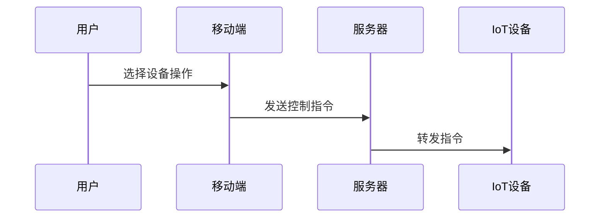

# 简介
对于IDK框架，重点是硬件接口的设计，包括外设——UART、SPI、I2C等。交叉编译工具链的配置及存储路劲的索引，方便各系统之间的构建和编译。BT和WIFI的相关使用接口。
事先准备好以下需求：

* 代码下载：将压缩包复制到linux系统下，并解压至自定义文件中
* JZW7258开发板
* 串口烧录工具

## JZW7258 SDK代码下载
准备一个Ubuntu系统，将SDK压缩包放入其系统中，使用其下命令解压至JZW7258：
```plantuml
$sudo tar xvf jzw7258_tar.gz -C jzw7258
```

## 交叉编译工具链部署
仅Linux系统下的编译，要求Ubuntu 20.04版本。

### 本地部署:  
**脚本安装** ：SDK中存在安装脚本，进入其中安装脚本即可完成构建环境安装
```plantuml
cd bk_idk
sudo bash tools/env_tools/setup/armino_env_setup.sh
```
**若脚本安装失败可手动安装**:
* 解压工具包至/opt/目录下：
```plantuml 
$sudo tar -xvjf gcc-arm-none-eabi-10.3-2021.10-x86_64-linux.tar.bz2 -C /opt/
```
工具链默认路径在 middleware/soc/bk7258/bk7258.defconfig 文件中定义，可在其中更改工具链路径：
```plantuml 
CONFIG_TOOLCHAIN_PATH="/opt/gcc-arm-none-eabi-10.3-2021.10/bin"
```
* 安装依赖库：
```plantuml
$sudo apt update
$sudo apt install make cmake python3 python3-pip ninja-build -y
```
安装python依赖库
```plantuml
$sudo pip3 install pycryptodome click future click_option_group cryptography jinja2 PyYAML cbor2 intelhex numpy
```
使用下述命令将默认Python2改为Python3,因为Python最低要求版本为Python3.8
```plantuml
$sudo ln -s /usr/bin/python3 /usr/bin/python
```
## 编译工程
终端下输入命令编译默认工程
```plantuml
$make bk7258  
```
若针对性选择某项目编译，则使用PROJECT参数编译，例如编译uart这个例程，参数值选择uart路径
```plantuml
$make bk7258 PROJECT=examples/peripherals/uart
```
修改工程后需重新编译工程时，需先清理构建再次重新make:
```plantuml
$make clean
```
编译文件位于，build文件夹中，进入相应项目名称，找到all_app.bin文件，在windows下准备烧录。

## 新建工程
在IDK框架中新建工程，目的为模块化测试，以验证单一外围电路模块功能是否正常，不牵涉多线程工作方式。
新建工程位于 project文件夹下，包含main文件夹、CmakeLists.tx，具体可参考project文件下的工程。

## 代码烧录
JZW7258通过DEBUG接口进行烧录，RX和TX信号确认接正确后，先确认开发板通电，再确认串口USB板接入PC端
烧录工具获取链接：https://dl.bekencorp.com/tools/flash/
烧录工具BKFIL开盒即用，选择串口后，选择15000000速率，选择Bin文件路径。按住开发板复位键，再点击BKFIL中烧录按钮，松开复位键即可，等待done，即可成功。


<!-- ## 设备控制模块

### 设备控制流程


### 性能指标
| 场景 | 响应时间 | 并发用户 |
|------|----------|----------|
| 单个设备控制 | < 500ms | 1000+ |
| 场景模式执行 | < 2s | 500+ |
| 批量设备操作 | < 5s | 100+ | -->