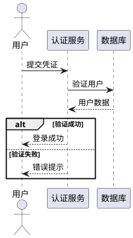
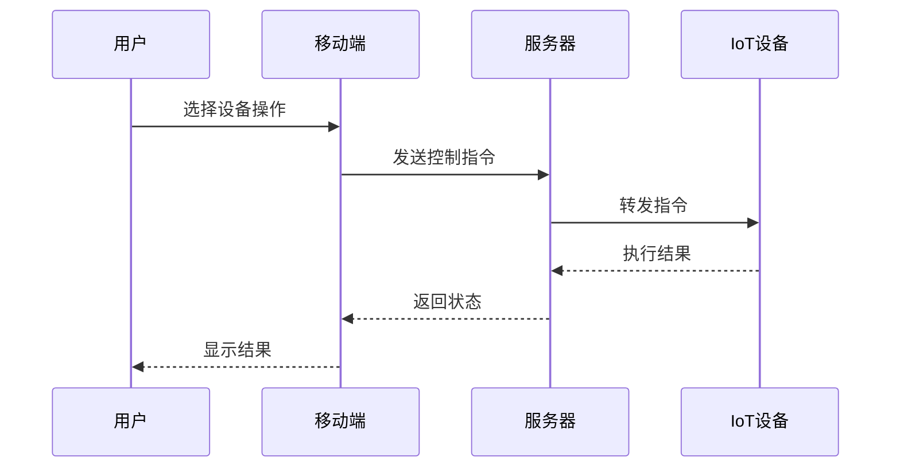

# 功能需求

## 用户认证模块

### 登录功能
**需求ID**: AUTH-001  
**优先级**: 高  
**描述**: 用户通过用户名密码登录系统  

### 功能列表
| 功能 | 状态 | 预计完成 |
|------|------|----------|
| 用户名密码登录 | 已完成 | 2023-10-01 |
| 短信验证码登录 | 开发中 | 2023-11-15 |
| 第三方OAuth登录 | 规划中 | 2023-12-01 |

## 设备控制模块

### 设备控制流程

### 性能指标
| 场景 | 响应时间 | 并发用户 |
|------|----------|----------|
| 单个设备控制 | < 500ms | 1000+ |
| 场景模式执行 | < 2s | 500+ |
| 批量设备操作 | < 5s | 100+ |